= Metis
:experimental:

English | link:doc/README.ko.adoc[한국어]

Metis aims to be a local-first knowledge tool that uses standard AsciiDoc documents as the source of truth. Built around file ownership and tool independence, it helps users structure, compose, reuse, and explore connected knowledge.

== Development philosophy

*Knowledge should remain in the user's files, and tools should help users work with it.* Metis aims to provide an AsciiDoc-based knowledge environment where documents remain readable, editable, and reusable even after users stop using the app.

link:doc/diagrams/philosophy-en.mmd[Mermaid source]

The following principles guide implementation and feature decisions. Document meaning and portability take priority when adding convenience features.

* *AsciiDoc source first:* Respect its syntax and semantics, and avoid custom syntax where the standard can express the content. Derived data, such as search indexes and graphs, must be rebuildable from the source.
* *Files and ownership first:* Use local plain text files as the foundation of knowledge. The same documents should work with other editors, Git, and AsciiDoc tools.
* *Meaning and reuse:* Prioritize document meaning over presentation. Use `include`, attributes, and `xref` to compose and reuse documents.
* *Extensions that preserve the source:* Design plugins and AI to assist document work. Knowledge must remain readable and durable when those features are removed.

The principles above guide development priorities and decisions.

== Development environment

Metis is a desktop app built with Electron, React, and TypeScript. npm workspaces manage the app and shared packages.

[cols="1,3",options="header"]
|===
| Requirement | Details
| Node.js | `>=24.21.0 <25`; *24.21.0* is the reproducibility and CI baseline
| npm | *11.19.0* was used for existing local validation; install using the root `package-lock.json`
| Operating system | Locally validated on Windows x64. CI is configured for macOS and Linux, but execution has not yet been validated
| Runtime environment | A desktop environment capable of displaying Electron windows. Network access is required for the initial dependency and Electron installation
|===

Run all commands from the *repository root*. Basic usage requires no separate `.env` file, external server, or database configuration.

== Install, build, and run

[source,sh]
----
npm ci
npm start
----

`npm start` builds the app and launches Electron. Select *Open folder (폴더 열기)* to open a folder containing AsciiDoc documents, or start with *New workspace (새 작업 공간)*. Use *New document (새 문서)* to create a document in the workspace.

To build without launching the app:

[source,sh]
----
npm run build
----

Build output is written to `apps/desktop/dist/`. There is currently no development server, watch mode, or HMR command. After editing the source, close the running app and run `npm start` again.

link:doc/diagrams/development-en.mmd[Mermaid source]

== Validate changes

[source,sh]
----
npm run check
npm run test:integration
----

[cols="1,3",options="header"]
|===
| Command | Purpose
| `npm run check` | Type checking → unit tests → tooling tests → build
| `npm run typecheck` | Run type checking only
| `npm test` | Run Vitest unit tests only
| `npm run test:desktop` | Run basic smoke checks against the built development app
| `npm run test:integration` | Run PRE-04, M1-01–08, M2-01–07, and M3-01–03 integration checks against the built development app
|===

GUI tests do not build the app themselves. Run `npm run check` or `npm run build` first. Test workspaces, profiles, and results are created under `.pre04-runs/`. Integration results and per-stage logs are written to `.pre04-runs/integration-*/`.

Linux CI installs system dependencies with `npx playwright install-deps chromium` and runs GUI tests with `xvfb-run -a npm run test:integration`.

== Package the app

[source,sh]
----
npm run package
npm run test:integration:packaged
----

`package` includes a build and creates an *application folder for the current host OS and architecture* under `.pre04-runs/package-*/out/`. It does not include an installer, signing, or automatic updates. The latest package staging path is recorded in `.pre04-runs/latest-package.txt`, which packaged integration tests read automatically.

To launch the packaged app directly from Windows PowerShell:

[source,powershell]
----
$metisPackage = Get-Content .pre04-runs/latest-package.txt
& "$metisPackage/out/Metis-win32-x64/Metis.exe"
----

This example targets Windows x64. On Linux, run packaged GUI tests with `xvfb-run -a npm run test:integration:packaged`.

== Respect — Obsidian and AsciiDoc

Metis respects and draws inspiration from Obsidian and AsciiDoc.

*Obsidian* is an important reference for Metis's approach to local-first work, user-owned knowledge, connections and exploration between documents, and extensible workflows. We aim to learn from the experience it offers people building and connecting their own knowledge.

*AsciiDoc* provides the foundation for Metis's document philosophy and source format. We value meaningful plain text, the separation of content and presentation, and document structure, composition, and reuse. We aim to keep documents usable with existing AsciiDoc tools.

We thank the developers and contributors who have built and sustained both projects and their ecosystems. Inspired by their work, Metis aims to create a knowledge workspace that stays true to AsciiDoc.

== Contributing and Git policy

See link:doc/git-strategy.adoc[Git strategy] for PR labels, required checks, squash merges, and release tag protection.
