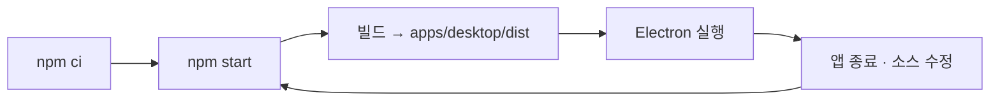

# Metis

Metis는 표준 AsciiDoc 문서를 지식의 원본으로 삼는 로컬 우선 지식 도구를 지향합니다. 파일 기반의 소유권과 도구 독립성을 바탕으로, 문서의 구조화·조합·재사용과 연결된 지식 탐색을 지원하는 것이 목표입니다.

## 개발 환경

Electron·React·TypeScript 기반 데스크톱 앱이며, npm workspaces로 앱과 공통 패키지를 관리합니다.

| 항목 | 필수 정보 |
| --- | --- |
| Node.js | `>=24.21.0 <25`; 재현 및 CI 기준은 **24.21.0** |
| npm | 기존 로컬 검증 기준 **11.19.0**; 루트 `package-lock.json`으로 설치 |
| 운영체제 | Windows x64 로컬 검증 완료. macOS·Linux는 CI 구성만 있으며 실행 검증 전 |
| 실행 환경 | Electron 창을 표시할 수 있는 데스크톱 환경. 최초 의존성·Electron 설치 시 네트워크 필요 |

모든 명령은 **저장소 루트**에서 실행합니다. 기본 실행에 별도 `.env` 파일이나 외부 서버·DB 설정은 필요하지 않습니다.

## 설치·개발 빌드·실행

```sh
npm ci
npm start
```

`npm start`는 앱을 빌드한 뒤 Electron을 실행합니다. 실행 후 **폴더 열기**로 AsciiDoc 문서가 있는 폴더를 선택하거나, **새 작업 공간**으로 시작하세요. 작업 공간에서 **새 문서**를 만들 수 있습니다.

빌드만 수행하려면 다음 명령을 사용합니다.

```sh
npm run build
```

결과는 `apps/desktop/dist/`에 생성됩니다. 현재 개발 서버·watch·HMR 명령은 없으므로 소스를 수정한 뒤 실행 중인 앱을 종료하고 `npm start`를 다시 실행합니다.



## 변경 사항 검증

```sh
npm run check
npm run test:integration
```

| 명령 | 용도 |
| --- | --- |
| `npm run check` | 타입 검사 → 단위 테스트 → 실행 도구 테스트 → 빌드 |
| `npm run typecheck` | 타입 검사만 실행 |
| `npm test` | Vitest 단위 테스트만 실행 |
| `npm run test:desktop` | 빌드된 개발 앱의 기본 기동 검사 |
| `npm run test:integration` | 빌드된 개발 앱의 PRE-04·M1-01~08·M2-01~07·M3-01~03 통합 검사 |

GUI 검사는 자체 빌드를 수행하지 않으므로 먼저 `npm run check` 또는 `npm run build`를 실행해야 합니다. 테스트용 작업 공간·프로필·결과는 `.pre04-runs/`에 생성되고, 통합 결과와 단계별 로그는 `.pre04-runs/integration-*/`에 기록됩니다.

Linux CI는 시스템 의존성 설치에 `npx playwright install-deps chromium`을 사용하고, GUI 검사는 `xvfb-run -a npm run test:integration`으로 실행합니다.

## 실행 파일 패키징

```sh
npm run package
npm run test:integration:packaged
```

`package`는 빌드를 포함하며 **현재 호스트 OS·아키텍처용 실행 폴더**를 `.pre04-runs/package-*/out/`에 생성합니다. 설치 프로그램·서명·자동 업데이트는 포함하지 않습니다. 최신 패키지의 staging 경로는 `.pre04-runs/latest-package.txt`에 기록되며 패키지 통합 검사가 이를 자동으로 읽습니다.

Windows PowerShell에서 패키지 앱을 직접 실행하는 예시입니다.

```powershell
$metisPackage = Get-Content .pre04-runs/latest-package.txt
& "$metisPackage/out/Metis-win32-x64/Metis.exe"
```

위 예시는 Windows x64 기준입니다. Linux의 패키지 GUI 검사는 `xvfb-run -a npm run test:integration:packaged`로 실행합니다.

## 개발 시 알아둘 위치와 경계

| 경로 | 역할 |
| --- | --- |
| `apps/desktop/src/main` | Electron 창·IPC·파일 작업 조정 |
| `apps/desktop/src/preload` | 화면에 노출하는 제한된 호스트 API |
| `apps/desktop/src/renderer` | React UI·CodeMirror 편집기 |
| `apps/desktop/src/utility` | 별도 프로세스의 문서 해석·검색 작업 |
| `packages/contracts` | IPC 타입·요청 검증·오류 규약 |
| `packages/workspace` | 작업 공간·파일 읽기/저장·복구·파일 변경 |
| `packages/document-core` | AsciiDoc 해석·참조·자동완성 |
| `packages/knowledge-index` | 문서 검색·색인 |
| `scripts` | 빌드·실행·패키징·GUI 검증 |

문서 원본은 작업 공간의 파일입니다. 실제 저장·이동·삭제가 가능하므로 동작을 실험할 때는 별도 테스트 폴더를 사용하세요. `METIS_USER_DATA` 환경변수로 앱 프로필 위치를 분리할 수 있습니다. 생성된 `dist/`와 `.pre04-runs/`는 Git 추적 대상이 아닙니다.
