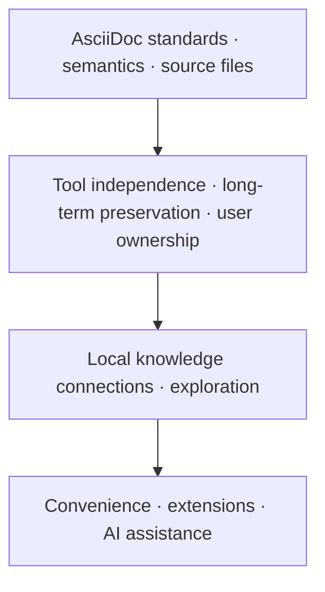
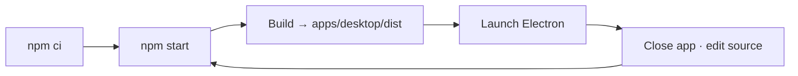
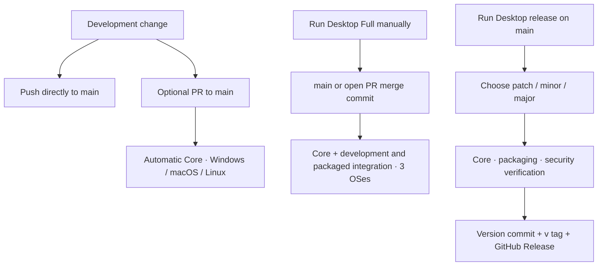

# Metis

English | [한국어](doc/README.ko.md)

Metis aims to be a local-first knowledge tool that uses standard AsciiDoc documents as the source of truth. Built around file ownership and tool independence, it helps users structure, compose, reuse, and explore connected knowledge.

## Development philosophy

**Knowledge should remain in the user's files, and tools should help users work with it.** Metis aims to provide an AsciiDoc-based knowledge environment where documents remain readable, editable, and reusable even after users stop using the app.



The following principles guide implementation and feature decisions. Document meaning and portability take priority when adding convenience features.

- **AsciiDoc source first:** Respect its syntax and semantics, and avoid custom syntax where the standard can express the content. Derived data, such as search indexes and graphs, must be rebuildable from the source.
- **Files and ownership first:** Use local plain text files as the foundation of knowledge. The same documents should work with other editors, Git, and AsciiDoc tools.
- **Meaning and reuse:** Prioritize document meaning over presentation. Use `include`, attributes, and `xref` to compose and reuse documents.
- **Extensions that preserve the source:** Design plugins and AI to assist document work. Knowledge must remain readable and durable when those features are removed.

See the [development philosophy](docs/development-philosophy.md) (in Korean) for detailed priorities and decision criteria.

## Development environment

Metis is a desktop app built with Electron, React, and TypeScript. npm workspaces manage the app and shared packages.

| Requirement | Details |
| --- | --- |
| Node.js | `>=24.21.0 <25`; **24.21.0** is the reproducibility and CI baseline |
| npm | **11.19.0** was used for existing local validation; install using the root `package-lock.json` |
| Operating system | Locally validated on Windows x64. CI is configured for macOS and Linux, but execution has not yet been validated |
| Runtime environment | A desktop environment capable of displaying Electron windows. Network access is required for the initial dependency and Electron installation |

Run all commands from the **repository root**. Basic usage requires no separate `.env` file, external server, or database configuration.

## Install, build, and run

```sh
npm ci
npm start
```

`npm start` builds the app and launches Electron. Select **Open folder (폴더 열기)** to open a folder containing AsciiDoc documents, or start with **New workspace (새 작업 공간)**. Use **New document (새 문서)** to create a document in the workspace.

To build without launching the app:

```sh
npm run build
```

Build output is written to `apps/desktop/dist/`. There is currently no development server, watch mode, or HMR command. After editing the source, close the running app and run `npm start` again.



## Validate changes

```sh
npm run check
npm run test:integration
```

| Command | Purpose |
| --- | --- |
| `npm run check` | Type checking → unit tests → tooling tests → build |
| `npm run typecheck` | Run type checking only |
| `npm test` | Run Vitest unit tests only |
| `npm run test:desktop` | Run basic smoke checks against the built development app |
| `npm run test:integration` | Run PRE-04, M1-01–08, M2-01–07, and M3-01–03 integration checks against the built development app |

GUI tests do not build the app themselves. Run `npm run check` or `npm run build` first. Test workspaces, profiles, and results are created under `.pre04-runs/`. Integration results and per-stage logs are written to `.pre04-runs/integration-*/`.

Linux CI installs system dependencies with `npx playwright install-deps chromium` and runs GUI tests with `xvfb-run -a npm run test:integration`.

## Package the app

```sh
npm run package
npm run test:integration:packaged
```

`package` includes a build and creates an **application folder for the current host OS and architecture** under `.pre04-runs/package-*/out/`. It does not include an installer, signing, or automatic updates. The latest package staging path is recorded in `.pre04-runs/latest-package.txt`, which packaged integration tests read automatically.

To launch the packaged app directly from Windows PowerShell:

```powershell
$metisPackage = Get-Content .pre04-runs/latest-package.txt
& "$metisPackage/out/Metis-win32-x64/Metis.exe"
```

This example targets Windows x64. On Linux, run packaged GUI tests with `xvfb-run -a npm run test:integration:packaged`.

## Git, CI, and releases

Development uses `main` with optional short-lived branches and PRs. Small changes can be pushed directly to `main`; PRs are useful when a review or automatic Core checks are wanted. Branch protection is not required by this workflow.



| Workflow | Trigger | Checks |
| --- | --- | --- |
| Desktop Core | PR opened, updated, or reopened against `main` | `npm ci` and `npm run check` on all three OSes; newer PR commits cancel older Core runs |
| Desktop Full | Manual only | Core, development integration, packaging, and packaged integration on all three OSes |
| Desktop release | Manual only, from `main` | Automatic version increment, Core, packaging, existing security verification, and publication |

Pushing to `main` or pushing a tag does not trigger validation or a release. Full is optional and is not a prerequisite for merging or releasing.

In **GitHub → Actions → Desktop Full → Run workflow**, leave `pr_number` empty to validate `main`, or enter an open PR number targeting `main` to validate its merge commit. The workflow resolves one commit SHA for all three OSes. Invalid, closed, or conflicting PRs fail before validation starts. Full results are available in Actions; this workflow is not a required PR check.

To release, select **Actions → Desktop release → Run workflow**, choose branch **main**, and choose `bump`:

| Increment | Example from `0.2.3` |
| --- | --- |
| `patch` (default) | `0.2.4` |
| `minor` | `0.3.0` |
| `major` | `1.0.0` |

The workflow updates the root and workspace package versions and root lockfile together. It does not change experiment packages or dependency versions. Every OS packages the same prepared version commit. The existing ZIP assets, checksums, release notes, and VirusTotal policy are retained: initial, minor, and major releases require a scan; patch releases skip it. Scans require the `VIRUSTOTAL_API_KEY` repository secret.

The version commit and `vX.Y.Z` tag are pushed atomically only after all packaging and security checks pass. If `main` changes before that push, the run stops; start a new manual release. Release runs are serialized. Publication needs `contents: write` and repository rules that allow the workflow to push the version commit and tag.

Publication creates a draft, uploads and verifies its assets, then makes it public. If publishing fails after the push, use **Re-run failed jobs** on the same run. This reuses the exact candidate and tag without another version increment, resumes an incomplete draft, and verifies any existing public Release instead of creating a duplicate. Candidate and package artifacts are kept for 14 days, so retry within that period. Re-running all jobs starts preparation again and is not the recovery procedure after a successful push.

## Respect — Obsidian and AsciiDoc

Metis respects and draws inspiration from Obsidian and AsciiDoc.

**Obsidian** is an important reference for Metis's approach to local-first work, user-owned knowledge, connections and exploration between documents, and extensible workflows. We aim to learn from the experience it offers people building and connecting their own knowledge.

**AsciiDoc** provides the foundation for Metis's document philosophy and source format. We value meaningful plain text, the separation of content and presentation, and document structure, composition, and reuse. We aim to keep documents usable with existing AsciiDoc tools.

We thank the developers and contributors who have built and sustained both projects and their ecosystems. Inspired by their work, Metis aims to create a knowledge workspace that stays true to AsciiDoc.
