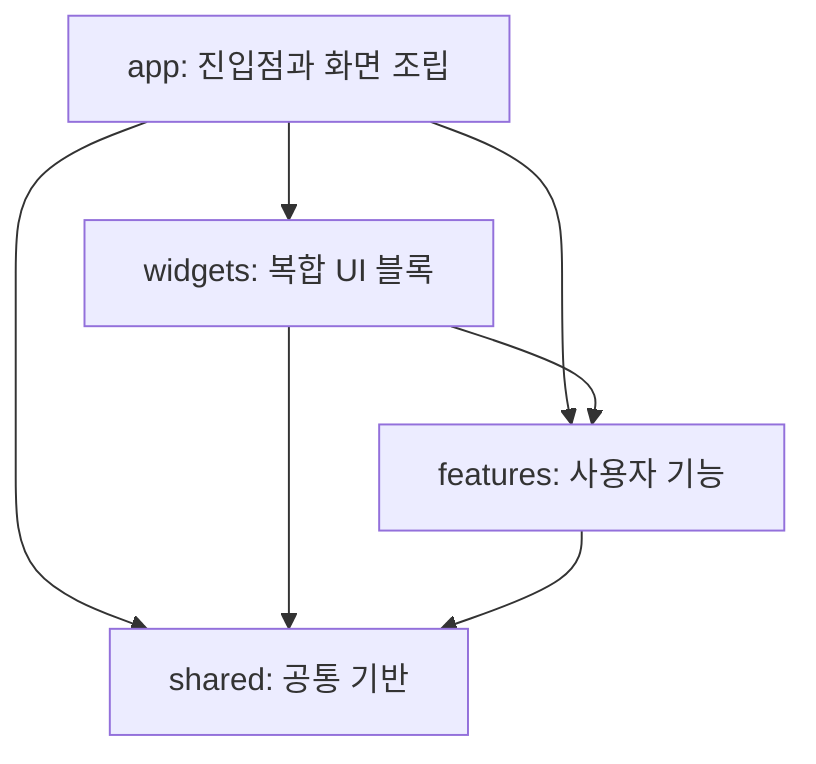

# Renderer 구조

Renderer는 Electron 프로세스 경계 안에서 경량 Feature-Sliced Design을 따른다.

## 계층 규칙

- `app`은 애플리케이션 시작, 전역 스타일, 상위 상태 조정을 담당한다.
- `widgets`는 여러 기능과 공통 요소를 조합하는 독립적인 화면 블록이다.
- `features`는 검색, Git, 변경 제안처럼 사용자 목적별 코드를 소유한다.
- `shared`는 기능 의미를 갖지 않는 모델, UI, 유틸리티와 공용 스타일을 제공한다.
- 같은 계층의 다른 slice를 직접 참조하지 않는다. 공유가 필요하면 하위 계층으로 옮긴다.
- slice 외부에서는 각 디렉터리의 `index.ts` 공개 API를 사용한다.
- 업무 계약과 도메인 처리는 기존 `@metis/contracts` 및 `packages/*` 경계를 유지한다.

`entities` 계층은 renderer가 독립적인 문서·세션 모델을 소유하게 될 때 추가한다. 현재 모델의 기준은 `@metis/contracts`이므로 중복 계층을 만들지 않는다.
