= Metis
:experimental:

link:../README.adoc[English] | 한국어

Metis는 표준 AsciiDoc 문서를 지식의 원본으로 삼는 로컬 우선 지식 도구를 지향합니다. 파일 기반의 소유권과 도구 독립성을 바탕으로, 문서의 구조화·조합·재사용과 연결된 지식 탐색을 지원하는 것이 목표입니다.

== 개발 철학

**지식은 사용자의 파일에 남고, 도구는 그 지식을 다루는 일을 도와야 합니다.** Metis는 앱을 사용하지 않게 되더라도 문서를 읽고 편집하고 재사용할 수 있는 AsciiDoc 기반 지식 환경을 지향합니다.

link:diagrams/philosophy-ko.mmd[Mermaid 원본]

아래 원칙은 구현과 기능 선택의 기준입니다. 편의 기능을 추가할 때도 문서의 의미와 이식성을 먼저 지킵니다.

* **AsciiDoc 원본 우선:** 문법과 의미를 존중하며, 표준으로 표현할 수 있는 내용에는 자체 문법을 만들지 않습니다. 검색 색인·그래프 같은 파생 데이터는 원본에서 다시 만들 수 있어야 합니다.
* **파일과 소유권 우선:** 로컬의 일반 텍스트 파일을 지식의 기반으로 삼습니다. 다른 편집기와 Git, AsciiDoc 도구에서도 같은 문서를 사용할 수 있어야 합니다.
* **의미와 재사용 중심:** 표현 방식보다 문서의 의미를 먼저 다룹니다. ``include``, 속성, ``xref``를 활용해 문서를 조합하고 재사용합니다.
* **원본을 지키는 확장:** 플러그인이나 AI는 문서 작업을 돕는 기능으로 설계합니다. 해당 기능이 없어져도 지식 자산의 가독성과 보존성을 유지해야 합니다.

위 원칙을 개발의 우선순위와 판단 기준으로 사용합니다.

== 개발 환경

Electron·React·TypeScript 기반 데스크톱 앱이며, npm workspaces로 앱과 공통 패키지를 관리합니다.

[cols="1,3",options="header"]
|===
| 항목 | 필수 정보
| Node.js | ``>=24.21.0 <25``; 재현 및 CI 기준은 **24.21.0**
| npm | 기존 로컬 검증 기준 **11.19.0**; 루트 ``package-lock.json``으로 설치
| 운영체제 | Windows x64 로컬 검증 완료. macOS·Linux는 CI 구성만 있으며 실행 검증 전
| 실행 환경 | Electron 창을 표시할 수 있는 데스크톱 환경. 최초 의존성·Electron 설치 시 네트워크 필요
|===

모든 명령은 **저장소 루트**에서 실행합니다. 기본 실행에 별도 ``.env`` 파일이나 외부 서버·DB 설정은 필요하지 않습니다.

== 설치·개발 빌드·실행

[source,sh]
----
npm ci
npm start
----

``npm start``는 앱을 빌드한 뒤 Electron을 실행합니다. 실행 후 **폴더 열기**로 AsciiDoc 문서가 있는 폴더를 선택하거나, **새 작업 공간**으로 시작하세요. 작업 공간에서 **새 문서**를 만들 수 있습니다.

빌드만 수행하려면 다음 명령을 사용합니다.

[source,sh]
----
npm run build
----

결과는 ``apps/desktop/dist/``에 생성됩니다. 현재 개발 서버·watch·HMR 명령은 없으므로 소스를 수정한 뒤 실행 중인 앱을 종료하고 ``npm start``를 다시 실행합니다.

link:diagrams/development-ko.mmd[Mermaid 원본]

== 변경 사항 검증

[source,sh]
----
npm run check
npm run test:desktop:core
----

PR마다 Windows·macOS·Linux에서 `npm run check`를 실행합니다. 핵심 GUI 검사는 로컬 또는 수동 Full에서 실행하며, PR에서는 패키징과 GUI 검사를 실행하지 않습니다.

[cols="1,3",options="header"]
|===
| 명령 | 용도
| ``npm run check`` | 타입 검사·단위 테스트·도구 테스트·빌드
| ``npm run test:desktop:core`` | 빌드된 개발 앱의 핵심 문서 흐름
| ``npm run test:integration`` | 기존 31개 시나리오와 핵심 흐름의 전체 개발 앱 검사
| ``npm run test:integration:packaged`` | 최신 패키지 앱에서 동일한 전체 검사
|===

GUI 검사는 자체 빌드를 하지 않으므로 먼저 check 또는 build 명령을 실행합니다. 결과는 ``.pre04-runs/core-*/`` 및 ``.pre04-runs/integration-*/``에 저장됩니다. Linux GUI 검사는 Xvfb에서 실행합니다.

== 실행 파일 패키징

[source,sh]
----
npm run package
npm run test:integration:packaged
----

``package``는 빌드를 포함하며 **현재 호스트 OS·아키텍처용 실행 폴더**를 ``.pre04-runs/package-*/out/``에 생성합니다. 설치 프로그램·서명·자동 업데이트는 포함하지 않습니다. 최신 패키지의 staging 경로는 ``.pre04-runs/latest-package.txt``에 기록되며 패키지 통합 검사가 이를 자동으로 읽습니다.

Windows PowerShell에서 패키지 앱을 직접 실행하는 예시입니다.

[source,powershell]
----
$metisPackage = Get-Content .pre04-runs/latest-package.txt
& "$metisPackage/out/Metis-win32-x64/Metis.exe"
----

위 예시는 Windows x64 기준입니다. Linux의 패키지 GUI 검사는 ``xvfb-run -a npm run test:integration:packaged``로 실행합니다.

== Git·CI·릴리즈 운영

`main` 중심으로 개발하며 짧은 작업 브랜치와 PR은 필요할 때 사용합니다. 작은 변경은 `main`에 직접 push할 수 있고, 검토나 자동 Core 검사가 필요하면 PR을 만듭니다. 이 구성은 브랜치 보호를 강제하지 않습니다.

image::diagrams/git-policy.svg[Git workflow]

link:diagrams/git-policy.mmd[Mermaid source]

[cols="1,3,3",options="header"]
|===
|워크플로
|실행 조건
|검사 범위
|Desktop Core
|`main` 대상 PR 생성·코드 갱신·재오픈
|3개 OS의 `npm ci`, `npm run check`; 새 PR 커밋이 올라오면 이전 Core 실행 취소
|Desktop Full
|수동 전용
|3개 OS의 Core·개발 앱 통합 검사·패키징·패키지 통합 검사
|Desktop release
|`main`에서 수동 전용
|자동 버전 증가·Core·패키징·기존 보안 검증·게시
|===

`main`이나 태그에 push해도 검사와 릴리즈는 자동 실행되지 않습니다. Full은 선택 사항이며 병합·릴리즈의 필수 조건으로 두지 않습니다.

**GitHub → Actions → Desktop Full → Run workflow**에서 `pr_number`를 비우면 `main`을 검사합니다. `main`을 대상으로 하는 열린 PR 번호를 입력하면 해당 PR의 병합 커밋을 검사합니다. 세 OS는 하나로 고정된 커밋 SHA를 사용합니다. 잘못된 번호, 닫힌 PR, 병합 충돌이 있는 PR은 검사 전에 실패합니다. Full 결과는 Actions에서 확인하며 PR 필수 체크로 등록하지 않습니다.

릴리즈는 **Actions → Desktop release → Run workflow**에서 브랜치 **main**과 `bump`를 선택합니다.

[cols="1,3",options="header"]
|===
|증가 종류
|`0.2.3` 기준 예시
|`patch` (기본값)
|`0.2.4`
|`minor`
|`0.3.0`
|`major`
|`1.0.0`
|===

루트·모든 workspace의 패키지 버전과 루트 lockfile을 함께 갱신합니다. 실험용 프로젝트와 의존성 버전은 변경하지 않습니다. 세 OS는 동일한 버전 커밋을 패키징합니다. 기존 ZIP 배포 파일·체크섬·릴리즈 노트와 VirusTotal 정책을 유지합니다. 최초·minor·major 릴리즈는 스캔하며 patch는 생략합니다. 스캔에는 저장소 secret `VIRUSTOTAL_API_KEY`가 필요합니다.

패키징과 보안 검증을 모두 통과한 뒤에만 버전 커밋과 `vX.Y.Z` 태그를 atomic push합니다. push 직전에 `main`이 변경됐으면 종료하므로 새 수동 릴리즈를 시작합니다. 릴리즈 실행은 직렬화합니다. 게시 job에는 `contents: write`와 버전 커밋·태그 push를 허용하는 저장소 규칙이 필요합니다.

게시는 draft 생성 → 파일 업로드·검증 → 공개 순서로 진행합니다. push 이후 게시가 실패하면 같은 실행에서 **Re-run failed jobs**를 선택합니다. 준비한 커밋과 태그를 재사용해 버전을 다시 증가시키지 않으며, 미완성 draft는 이어서 완성하고 이미 공개된 Release는 일치 여부를 확인해 중복 생성을 막습니다. 후보 커밋과 패키지 artifact 보관 기간은 14일이므로 그 안에 재시도해야 합니다. **Re-run all jobs**는 준비 단계를 다시 실행하므로 push 성공 이후의 복구 방법으로 사용하지 않습니다.

== Respect — Obsidian과 AsciiDoc

Metis는 Obsidian과 AsciiDoc에서 받은 영감을 존중합니다.

**Obsidian**은 Metis가 로컬 우선 접근, 사용자 소유의 지식, 문서 간 연결과 탐색, 확장 가능한 작업 환경을 고민하는 데 중요한 참고 모델입니다. 개인이 자신의 지식을 쌓고 연결하는 경험에서 배우고자 합니다.

**AsciiDoc**은 Metis의 문서 철학과 원본 형식의 기반입니다. 의미를 담은 일반 텍스트, 내용과 표현의 분리, 문서의 구조화·조합·재사용이라는 가치를 존중하며, 기존 AsciiDoc 도구와 함께 사용할 수 있는 문서를 지향합니다.

두 프로젝트와 생태계를 발전시켜 온 개발자와 기여자들에게 감사드립니다. Metis는 이 영감을 바탕으로 AsciiDoc에 충실한 지식 작업 환경을 만들어 가고자 합니다.

== 기여 및 Git 정책

선택적 PR, 분류, 수동 검사와 릴리스 복구는 link:git-strategy.adoc[Git 전략]을 참고하세요.
