= Git 전략

link:diagrams/git-policy.mmd[Mermaid 원본]

== 브랜치와 병합

`main`에서 짧게 유지하는 작업 브랜치를 만들고 PR을 통해 병합합니다.
브랜치 이름은 `feature/*`, `fix/*`, `refactor/*`, `docs/*`, `chore/*`를 권장하며 Codex 작업은 `codex/*`를 사용합니다.
장기 `develop`이나 릴리스 브랜치는 현재 도입하지 않습니다.

PR 제목은 Conventional Commits 형식입니다. 예: `feat(editor): add split view`, `fix: correct parsing`, `refactor(core)!: change plugin contract`.
허용 type은 `feat`, `fix`, `perf`, `refactor`, `docs`, `test`, `build`, `ci`, `chore`, `style`, `revert`입니다.
scope와 `!`는 선택이며, 제목은 한 줄로 작성합니다.
Squash만 허용하여 PR 하나가 main의 커밋 하나가 됩니다. Squash 커밋 제목은 PR 제목입니다.

== 변경 분류

[cols="1,3",options="header"]
|===
|라벨 |의미
|`type:feature` |기능 추가
|`type:bug` |버그 수정
|`type:breaking` |호환성을 깨는 변경
|`type:performance` |성능 개선
|`type:refactor` |리팩터링
|`type:docs` |문서 변경
|`type:chore` |빌드·CI·의존성 등 유지보수
|===

지원되는 `type:*` 라벨을 하나 이상 붙입니다. `type:breaking`은 단독 또는 다른 분류와 함께 사용할 수 있습니다.
알 수 없는 `type:*` 라벨은 검사를 실패시킵니다. `version:*`는 필수가 아니며 변경 분류를 대신하지 않습니다.
`area:editor`, `area:asciidoc`, `area:plugin`, `area:ui`, `area:workspace`, `area:build`는 선택 항목입니다.
제목·라벨 변경과 코드 갱신 시 PR 정책 검사를 다시 실행합니다.

== main 보호와 검증

PR을 통한 병합, 대화 해결, 최신 main 반영 및 다음 GitHub Actions 검사 통과를 요구합니다.

* `PR policy`
* `Desktop core / windows-2022`
* `Desktop core / macos-14`
* `Desktop core / ubuntu-22.04`

1인 개발을 지원하기 위해 필수 승인 리뷰 수는 0명입니다.
main 삭제, 강제 push 및 우회 사용자를 허용하지 않으며 선형 이력을 요구합니다.
PR 핵심 검증은 3개 OS에서 `npm run check`와 `npm run test:desktop:core`를 실행합니다.
GUI 검사는 앱 기동, 작업 공간 열기, 문서 생성·편집·저장·재열기, AsciiDoc 미리보기, 검색과 원문 보존을 확인합니다.
PR에서 패키징이나 전체 GUI 회귀 검사를 실행하지 않습니다. 새 커밋이 올라오면 이전 핵심 검사를 취소합니다.
PR 코드 실행은 읽기 권한의 `pull_request` 이벤트를 사용하고 secrets를 전달하지 않습니다.

새 필수 검사는 실제 PR에서 성공한 후 등록합니다. 기존 CI 실패가 있으면 원인을 해결하고 성공을 확인한 다음 활성화합니다.
도입 시 `main-protection`과 `release-tag-protection`을 먼저 활성화합니다.
`main-required-checks`는 최신 main을 반영한 PR의 네 검사 통과가 확인될 때까지 비활성 상태로 유지합니다.
따라서 이 도입 기간에는 필수 검사와 최신 main 반영이 아직 강제되지 않습니다.

== 버전과 릴리스

`Desktop full validation`은 수동 실행만 허용합니다. 기존 31개 GUI 시나리오와 핵심 시나리오를 개발 앱과 패키지 앱에서 모두 검증하며,
3개 OS의 타입·단위·도구 검사 및 패키징을 유지합니다. 전체 검사는 PR 병합 조건이 아니라 릴리스 조건입니다.

[source,sh]
----
gh workflow run desktop-validation.yml --ref main
gh run list --workflow desktop-validation.yml --event workflow_dispatch --branch main
gh run watch RUN_ID --exit-status
gh run view RUN_ID --json headSha,url,conclusion
----

Actions 화면에서도 `Desktop full validation`의 `Run workflow`에서 main을 선택할 수 있습니다.
성공한 실행의 `headSha`에 태그를 만듭니다. 검사 중 main이 전진해도 새 HEAD를 대신 사용하지 않습니다.
release workflow는 태그의 실제 커밋 SHA에 대해 main에서 수동 실행한 전체 검증 중 가장 최근 실행과 그 최신 attempt의 3개 OS 결과를 확인합니다.
진행 중·실패·취소·skipped·누락·SHA 불일치 또는 API 오류이면 패키징을 시작하지 않습니다.
전체 검사 자체는 태그나 릴리스를 생성하지 않습니다.

릴리스가 차단되면 해당 SHA의 기존 전체 검증 실행을 재실행해 성공시킨 뒤 릴리스의 실패 job을 재실행합니다.
기존 실행이 없고 main이 아직 해당 SHA라면 main에서 전체 검증을 시작합니다.
main이 이미 전진했고 해당 SHA의 수동 검증 실행도 없다면 태그를 이동하지 않고 현재 main을 검증한 새 버전으로 릴리스합니다.

PR은 변경 의미를 기록하고 SemVer는 릴리스 시점에 관리자가 결정합니다.
Git 태그가 릴리스 식별자이며 병합마다 버전을 올리지 않습니다.
내부 빌드 식별, 자동 SemVer 제안, Canary/RC 및 릴리스 자동화 확대는 후속 작업입니다.

현재 release workflow는 안정 SemVer `X.Y.Z` 또는 `vX.Y.Z` 태그와 `package.json` 버전 일치를 검사합니다.
태그 생성 권한은 유지하고 아래 패턴의 기존 태그 업데이트·삭제를 금지합니다. 우회 사용자는 없습니다.

[source,text]
----
refs/tags/[0-9]*.[0-9]*.[0-9]*
refs/tags/v[0-9]*.[0-9]*.[0-9]*
----

이 패턴은 보호 범위를 지정하는 glob이며 엄밀한 SemVer 검증은 release workflow가 담당합니다.
릴리스 태그의 커밋을 바꾸는 대신 새 버전으로 수정 사항을 배포합니다.

== 문서 다이어그램

`doc/diagrams/*.mmd`를 원본으로 관리하고 같은 이름의 SVG를 함께 갱신합니다.
README는 SVG를 표시하고 Mermaid 원본을 연결합니다.
의존성 설치 후 `node scripts/render-doc-diagrams.mjs`로 SVG를 재생성합니다.
이 명령은 Playwright Chromium을 사용합니다. 최초 실행 전 `npx playwright install chromium`으로 준비합니다.

== GitHub 설정 관리

ruleset과 병합 설정은 `gh api`로 적용합니다.
변경 전 설정과 전체 ruleset 응답을 로컬에 보관하고 기존 규칙을 확인하여 중복 생성하지 않습니다.
적용 후 대상 ref, 활성 상태, 필수 검사 이름·GitHub Actions 출처 및 우회 목록을 재조회합니다.
규칙 세부 사항은 https://docs.github.com/en/repositories/configuring-branches-and-merges-in-your-repository/managing-rulesets/available-rules-for-rulesets[GitHub 공식 문서]를 참고하세요.
