= Git 전략

link:diagrams/git-policy-ko.mmd[Mermaid 원본]

== 브랜치와 병합

`main` 중심으로 개발합니다. 작은 변경은 직접 push할 수 있으며, 검토나 자동 Core 검사가 필요하면 짧은 작업 브랜치와 PR을 사용합니다.
브랜치 이름은 `feature/*`, `fix/*`, `refactor/*`, `docs/*`, `chore/*`를 권장하며 Codex 작업은 `codex/*`를 사용합니다.
장기 `develop`이나 릴리스 브랜치는 현재 도입하지 않습니다.

PR 제목은 Conventional Commits 형식입니다. 예: `feat(editor): add split view`, `fix: correct parsing`, `refactor(core)!: change plugin contract`.
허용 type은 `feat`, `fix`, `perf`, `refactor`, `docs`, `test`, `build`, `ci`, `chore`, `style`, `revert`입니다.
scope와 `!`는 선택이며, 제목은 한 줄로 작성합니다.
PR 병합은 squash를 권장하며, squash 커밋 제목은 PR 제목을 사용합니다.

== 변경 분류

[cols="1,3",options="header"]
|===
|라벨 |의미
|`type:feature` |기능 추가
|`type:bug` |버그 수정
|`type:breaking` |호환성을 깨는 변경
|`type:performance` |성능 개선
|`type:refactor` |리팩터링
|`type:docs` |문서 변경
|`type:chore` |빌드·CI·의존성 등 유지보수
|===

지원되는 `type:*` 라벨을 하나 이상 붙입니다. `type:breaking`은 단독 또는 다른 분류와 함께 사용할 수 있습니다.
알 수 없는 `type:*` 라벨은 검사를 실패시킵니다. `version:*`는 필수가 아니며 변경 분류를 대신하지 않습니다.
`area:editor`, `area:asciidoc`, `area:plugin`, `area:ui`, `area:workspace`, `area:build`는 선택 항목입니다.
제목·라벨 변경과 코드 갱신 시 PR 정책 검사를 다시 실행합니다.

== 검사와 릴리스

PR은 기존 제목·라벨 정책 검사를 유지하며, Core는 3개 OS에서 `npm run check`만 실행합니다.
새 커밋이 올라오면 이전 Core 실행을 취소합니다. GUI 검사와 패키징은 수동 Full에서 실행합니다.
main과 태그 push는 검사나 릴리스를 자동 실행하지 않습니다. 브랜치 보호 규칙은 이번 변경에서 강제하거나 수정하지 않습니다.

**GitHub → Actions → Desktop Full → Run workflow**에서 `pr_number`를 비우면 `main`을 검사합니다. `main`을 대상으로 하는 열린 PR 번호를 입력하면 해당 PR의 병합 커밋을 검사합니다. 세 OS는 하나로 고정된 커밋 SHA를 사용합니다. 잘못된 번호, 닫힌 PR, 병합 충돌이 있는 PR은 검사 전에 실패합니다. Full 결과는 Actions에서 확인하며 PR 필수 체크로 등록하지 않습니다.

릴리즈는 **Actions → Desktop release → Run workflow**에서 브랜치 **main**과 `bump`를 선택합니다.

[cols="1,3",options="header"]
|===
|증가 종류
|`0.2.3` 기준 예시
|`patch` (기본값)
|`0.2.4`
|`minor`
|`0.3.0`
|`major`
|`1.0.0`
|===

루트·모든 workspace의 패키지 버전과 루트 lockfile을 함께 갱신합니다. 실험용 프로젝트와 의존성 버전은 변경하지 않습니다. 세 OS는 동일한 버전 커밋을 패키징합니다. 기존 ZIP 배포 파일·체크섬·릴리즈 노트와 VirusTotal 정책을 유지합니다. 최초·minor·major 릴리즈는 스캔하며 patch는 생략합니다. 스캔에는 저장소 secret `VIRUSTOTAL_API_KEY`가 필요합니다.

패키징과 보안 검증을 모두 통과한 뒤에만 버전 커밋과 `vX.Y.Z` 태그를 atomic push합니다. push 직전에 `main`이 변경됐으면 종료하므로 새 수동 릴리즈를 시작합니다. 릴리즈 실행은 직렬화합니다. 게시 job에는 `contents: write`와 버전 커밋·태그 push를 허용하는 저장소 규칙이 필요합니다.

게시는 draft 생성 → 파일 업로드·검증 → 공개 순서로 진행합니다. push 이후 게시가 실패하면 같은 실행에서 **Re-run failed jobs**를 선택합니다. 준비한 커밋과 태그를 재사용해 버전을 다시 증가시키지 않으며, 미완성 draft는 이어서 완성하고 이미 공개된 Release는 일치 여부를 확인해 중복 생성을 막습니다. 후보 커밋과 패키지 artifact 보관 기간은 14일이므로 그 안에 재시도해야 합니다. **Re-run all jobs**는 준비 단계를 다시 실행하므로 push 성공 이후의 복구 방법으로 사용하지 않습니다.

== 문서 다이어그램

`doc/diagrams/*.mmd`를 원본으로 관리하고 같은 이름의 SVG를 함께 갱신합니다.
README는 SVG를 표시하고 Mermaid 원본을 연결합니다.
의존성 설치 후 `node scripts/render-doc-diagrams.mjs`로 SVG를 재생성합니다.
이 명령은 Playwright Chromium을 사용합니다. 최초 실행 전 `npx playwright install chromium`으로 준비합니다.

== GitHub 설정 관리

ruleset과 병합 설정은 `gh api`로 적용합니다.
변경 전 설정과 전체 ruleset 응답을 로컬에 보관하고 기존 규칙을 확인하여 중복 생성하지 않습니다.
적용 후 대상 ref, 활성 상태, 필수 검사 이름·GitHub Actions 출처 및 우회 목록을 재조회합니다.
규칙 세부 사항은 https://docs.github.com/en/repositories/configuring-branches-and-merges-in-your-repository/managing-rulesets/available-rules-for-rulesets[GitHub 공식 문서]를 참고하세요.
